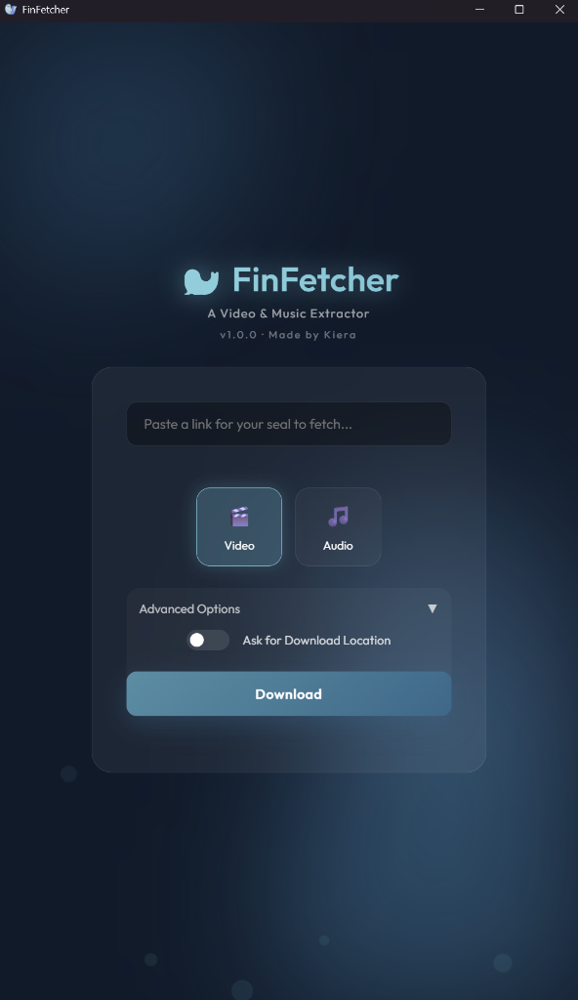
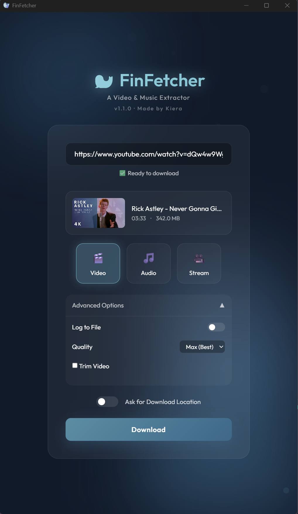

# 🦭 FinFetcher

A video & music downloader built with Python and PyWebView.
Supports hundreds of sites!

<p align="center">
  
</p>

## Screenshots

<p align="center">
  
  
</p>

## Features

- 🎬 **Video Download** - Download videos in various qualities (up to 4K/8K)
- 🎵 **Audio Extraction** - Extract audio as MP3
- ▶️ **Stream Playback** - Watch videos directly without downloading
- ✂️ **Video Trimming** - Trim videos to specific timestamps
- 📂 **Playlist Support** - Download entire playlists

## Download

Get the latest release from the [Releases](../../releases) page.

<!--
## Development Setup

1. Install Python 3.11+
2. Install dependencies:
   ```
   pip install -r requirements.txt
   ```
3. Run:
   ```
   python main.pyw
   ```
   Or use `run.bat` on Windows.

## Building

### Build EXE (Windows)
```
build exe.bat
```

### Build ZIP (Source)
```
build zip.bat
```
-->

## License

MIT License
