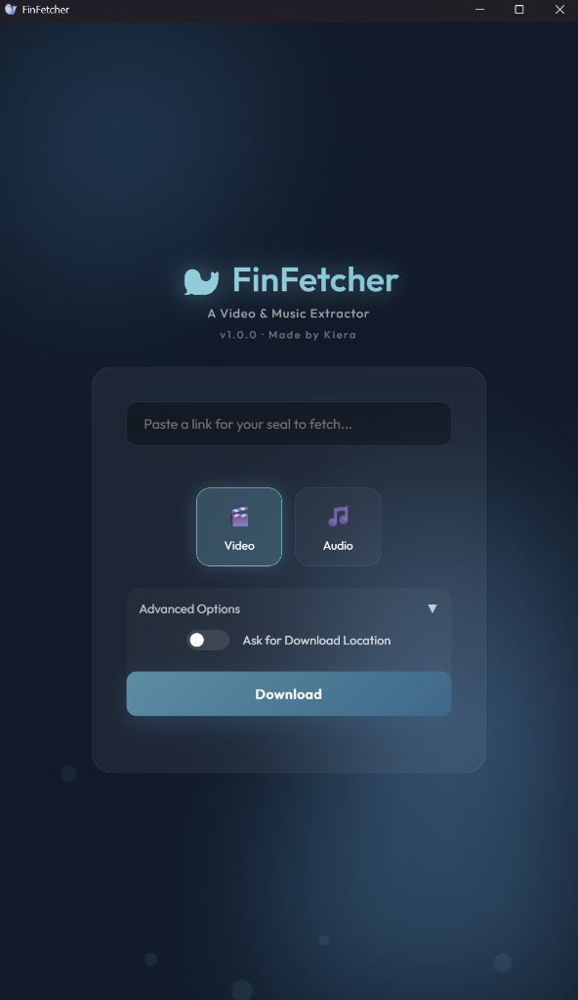
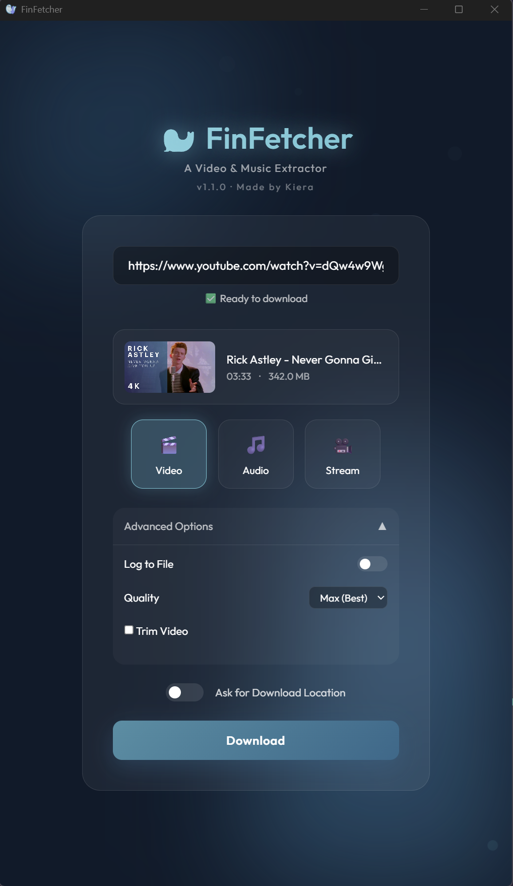

# 🦭 FinFetcher

A video & music downloader built with Python and PyWebView.
Supports hundreds of sites!

<p align="center">
  
</p>

## Screenshots

<p align="center">
  
  
</p>

## Features

- 🎬 **Video Download** - Download videos in various qualities (up to 4K/8K)
- 🎵 **Audio Extraction** - Extract audio as MP3
- ▶️ **Stream Playback** - Watch videos directly without downloading
- ✂️ **Video Trimming** - Trim videos to specific timestamps
- 📂 **Playlist Support** - Download entire playlists
- 🔄 **Auto-Update** - Check for and install updates directly from the app
- 🍪 **Cookie Auth** - Bypass YouTube 403 errors with browser cookie support

## Download

Get the latest release from the [Releases](../../releases) page.

<!--
## Development Setup

1. Install Python 3.11+
2. Install dependencies:
   ```
   pip install -r requirements.txt
   ```
3. Run:
   ```
   python main.pyw
   ```
   Or use `run.bat` on Windows.

## Building

### Build EXE (Windows)
```
build exe.bat
```

### Build ZIP (Source)
```
build zip.bat
```
-->

## License

FinFetcher is licensed under the [GNU General Public License v3.0](LICENSE).

You may use, modify and redistribute it. If you distribute a modified version,
that version has to be under the GPL too, with its source available.

GPL rather than something more permissive because of what ships inside the
build: FinFetcher bundles [mutagen](https://github.com/quodlibet/mutagen)
(GPL-2.0-or-later), which yt-dlp uses to write cover art into opus and flac
files. A binary containing it cannot be distributed under MIT terms.

FFmpeg is not bundled — the app downloads it on first run, so its own licence
applies to your copy of it, not to FinFetcher.
