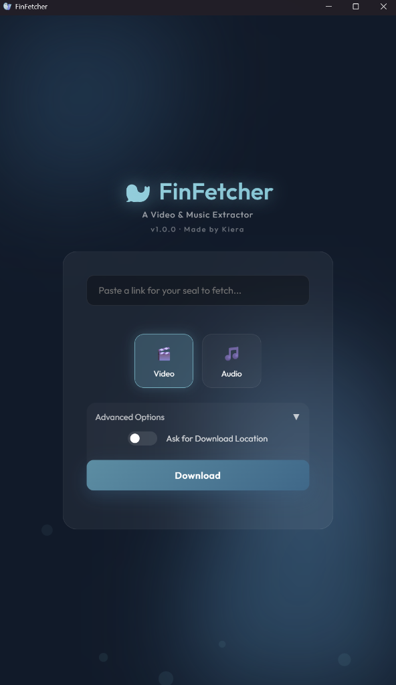
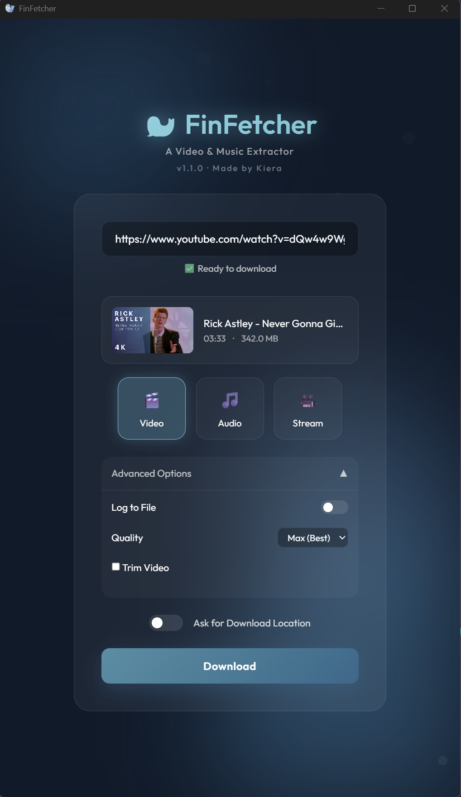

# 🦭 FinFetcher

A Windows video and music downloader built with Rust and Tauri. FinFetcher uses
yt-dlp for site extraction and FFmpeg for media processing.

<p align="center">
  
</p>

## Screenshots

<p align="center">
  
  
</p>

## Features

- 🎬 **Video Download** - Download videos in various qualities (up to 4K/8K)
- 🎵 **Audio Extraction** - Save MP3, M4A, FLAC, WAV, or Opus audio
- ▶️ **Stream Playback** - Watch videos directly without downloading
- ✂️ **Video Trimming** - Trim videos to specific timestamps
- 📂 **Playlist Support** - Download entire playlists
- 🔄 **Auto-Update** - Check for and install updates directly from the app
- 🍪 **Browser Cookies** - Use available browser cookies for authenticated downloads

## Download

Get the latest release from the [Releases](../../releases) page.

## Development Setup

Install Rust with the Windows MSVC toolchain, Visual Studio C++ build tools,
Node.js 22 or later, and Microsoft Edge WebView2 Runtime. Then run:

```powershell
npm ci
npm run dev
```

`run.bat` starts the same development workflow. Python is not required to build
or run FinFetcher. The separately downloaded official yt-dlp executable contains
its own runtime.

Settings and managed tools remain in `%APPDATA%\FinFetcher`. To test without
using an existing profile, pass an absolute data directory:

```powershell
npm run tauri -- dev -- --state-dir C:\Temp\FinFetcher-test
```

Automated startup checks can also pass `--hidden` to create the window without
showing it. This does not replace testing the visible controls.

FFmpeg can be selected from an existing installation or downloaded during setup.
FinFetcher downloads yt-dlp when needed and checks for updates according to its
settings. YouTube extraction can use a supported installed JavaScript runtime
or an automatically downloaded Deno runtime.

## Tests

```powershell
npm test
npm run build:frontend
cargo test --locked --manifest-path src-tauri/Cargo.toml
```

The real-media integration test requires yt-dlp, FFmpeg, and FFprobe on PATH.
It serves generated media over localhost and checks downloads, trimming,
audio extraction, filename conflicts, and cancellation:

```powershell
cargo test --locked --manifest-path src-tauri/Cargo.toml --test downloads -- --ignored --nocapture
```

Tool installation tests download official executables into temporary profiles:

```powershell
cargo test --locked --manifest-path src-tauri/Cargo.toml --lib tools::tests -- --ignored --nocapture
```

## Building

Install Inno Setup 6, then build the application and installer:

```powershell
npm run build
```

The installer is written to `dist_installer/FinFetcher-Setup.exe`. Its AppId and
default installation directory remain compatible with existing installations.
Build verification checks application and installer versions. The installer
includes Microsoft's WebView2 bootstrapper for systems without the runtime.

`build exe.bat` runs the same build. To produce a portable ZIP instead:

```powershell
.\scripts\build-portable.ps1
```

`version.txt` contains the intended release core. Build scripts generate the
application's version and source identity. CI alpha builds and numbered beta
releases use the same application and installer pipeline. Historical tags and
release assets are retained.

## License

FinFetcher is licensed under the [GNU General Public License v3.0](LICENSE).

You may use, modify and redistribute it. If you distribute a modified version,
that version has to be under the GPL too, with its source available.

Third-party notices and available dependency licenses are included in the
installer payload. yt-dlp, FFmpeg, Deno, and WebView2 retain their respective
licenses.
